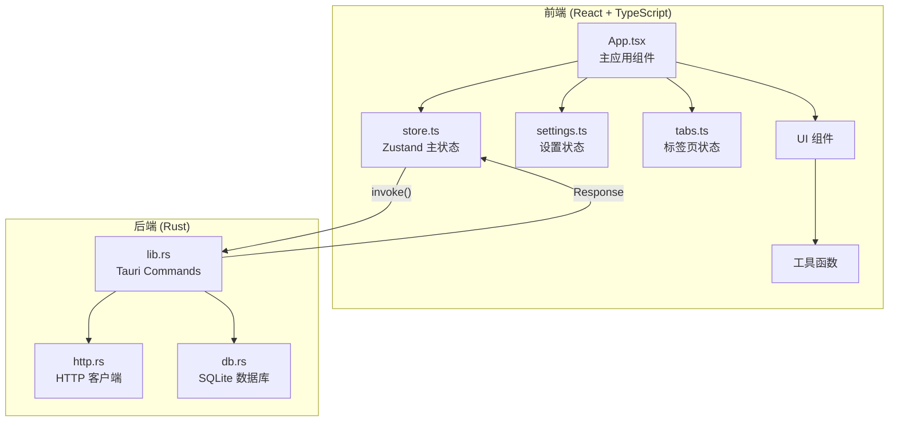
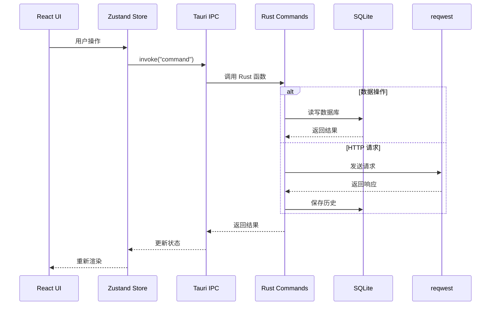
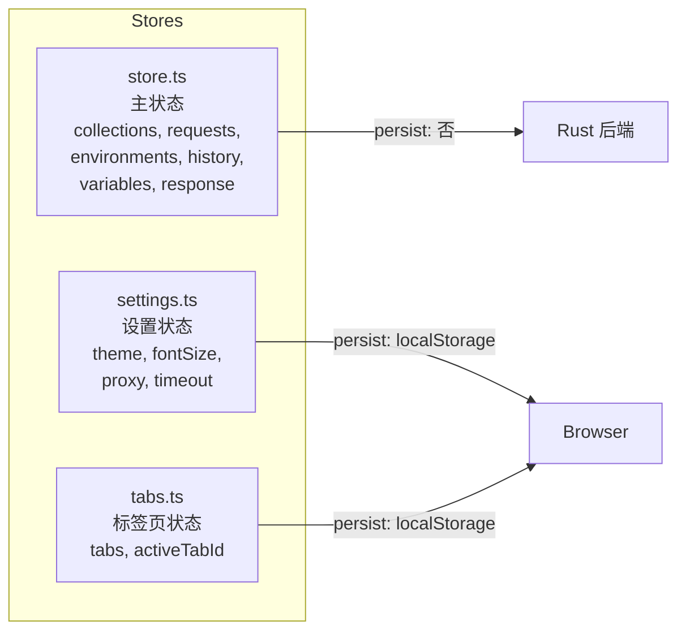

# GetMan - 系统架构

## 架构概览

GetMan 采用 Tauri 2.0 架构，前后端分离，通过 IPC (Tauri Commands) 通信。



## 通信架构

前后端通过 Tauri IPC 机制通信，前端调用 `@tauri-apps/api` 的 `invoke()` 函数触发后端 Tauri Commands。



## 状态管理架构



## 目录结构

```
GetMan/
├── src/                        # React 前端
│   ├── main.tsx                # 应用入口
│   ├── App.tsx                 # 主应用组件 (683 行)
│   ├── App.css                 # 主样式
│   ├── store.ts                # Zustand 主状态 (251 行)
│   ├── stores/                 # 辅助状态
│   │   ├── settings.ts         # 设置管理
│   │   └── tabs.ts             # 标签页管理
│   ├── components/             # UI 组件 (15 个)
│   ├── utils/                  # 工具函数 (5 个模块)
│   └── styles/                 # 全局样式
├── src-tauri/                  # Rust 后端
│   ├── src/
│   │   ├── main.rs             # Tauri 入口
│   │   ├── lib.rs              # Commands + 数据模型 (187 行)
│   │   ├── db.rs               # 数据库操作 (260 行)
│   │   └── http.rs             # HTTP 请求 (57 行)
│   ├── Cargo.toml              # Rust 依赖
│   └── tauri.conf.json         # Tauri 配置
├── docs/plans/                 # 设计文档
├── package.json                # 前端依赖
└── vite.config.ts              # Vite 配置
```

## 设计原则

1. **极简主义** - 不引入不必要的依赖，保持轻量
2. **离线优先** - 所有数据本地存储，无需网络
3. **本地安全** - 数据不离开用户设备
4. **性能优先** - Rust 后端保证高性能