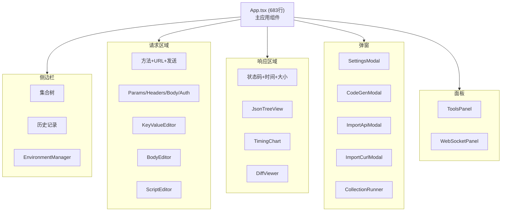

# GetMan - 组件文档

## 组件架构

## 核心组件

### App.tsx (683 行)
主应用组件，包含整体布局和核心交互逻辑。管理侧边栏、请求构建器、响应查看器的协调。

### 请求构建组件

| 组件 | 行数 | 职责 |
|------|------|------|
| BodyEditor | 123 | 请求体编辑，支持 JSON/Form/Raw/Binary |
| KeyValueEditor | 71 | 通用键值对编辑器，用于 Headers/Params |
| ScriptEditor | 67 | Pre-request/Post-response 脚本编辑 |

### 响应展示组件

| 组件 | 行数 | 职责 |
|------|------|------|
| JsonTreeView | 83 | JSON 树形展示，支持折叠/展开 |
| TimingChart | 78 | 请求时序图表 |
| DiffViewer | 117 | 响应差异对比 |

### 管理组件

| 组件 | 行数 | 职责 |
|------|------|------|
| EnvironmentManager | 215 | 环境变量管理，多环境切换 |
| CollectionRunner | 213 | 集合批量运行器 |
| ToolsPanel | 128 | 开发工具面板 (JWT/Base64/Hash 等) |
| WebSocketPanel | 100 | WebSocket 连接测试 |

### 弹窗组件

| 组件 | 行数 | 职责 |
|------|------|------|
| ImportApiModal | 128 | 导入 Postman/OpenAPI |
| SettingsModal | 79 | 应用设置 |
| CodeGenModal | 55 | 代码生成 |
| ImportCurlModal | 39 | 导入 cURL 命令 |

### 辅助组件

| 组件 | 行数 | 职责 |
|------|------|------|
| Icons | 92 | SVG 图标集合 |

## 工具函数模块

### codegen.ts (203 行)
代码生成引擎，支持 10 种输出格式：
- `generateCurl` / `parseCurl`
- `generateJsFetch` / `generateJsAxios`
- `generatePython` / `generateGo` / `generateRust` / `generateJava` / `generatePhp`
- `generateCode` (统一入口)

### scripting.ts (142 行)
脚本执行引擎 (`executeScript`)，支持 Pre-request 和 Post-response 脚本。

### openapi.ts (118 行)
API 规范解析：
- `parseOpenAPI` - 解析 OpenAPI/Swagger 规范
- `parsePostmanCollection` - 解析 Postman Collection

### tools.ts (83 行)
11 个实用工具函数：`parseJwt`, `base64Encode/Decode`, `urlEncode/Decode`, `timestampToDate/dateToTimestamp`, `generateUuid`, `computeHash`, `formatJson/minifyJson`

### diff.ts (63 行)
差异算法：`diffJson`, `diffText`, `computeLCS`