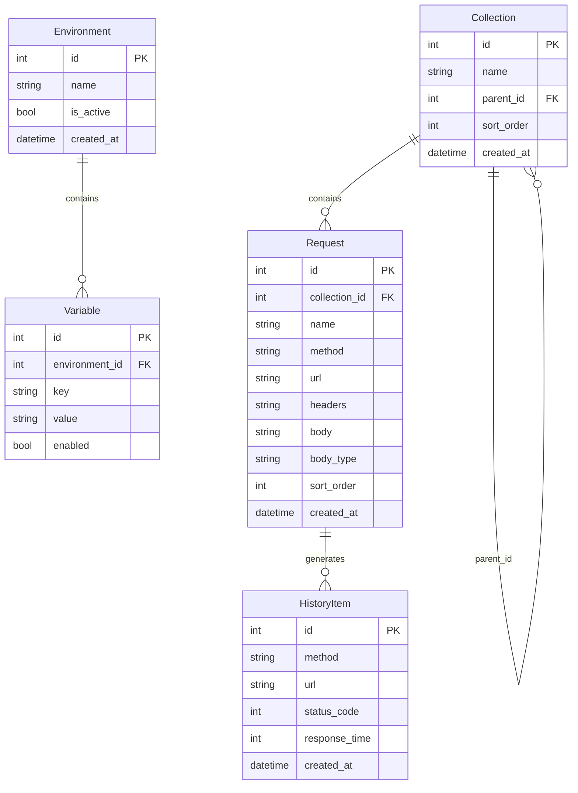

# GetMan - 数据模型

## 数据模型关系

## 前后端数据模型对照

### Collection

| 字段 | TypeScript | Rust | SQLite |
|------|-----------|------|--------|
| id | `number?` | `Option<i64>` | `INTEGER PK AUTOINCREMENT` |
| name | `string` | `String` | `TEXT NOT NULL` |
| parent_id | `number?` | `Option<i64>` | `INTEGER` |
| sort_order | `number` | `i32` | `INTEGER DEFAULT 0` |

### Request

| 字段 | TypeScript | Rust | SQLite |
|------|-----------|------|--------|
| id | `number?` | `Option<i64>` | `INTEGER PK AUTOINCREMENT` |
| collection_id | `number?` | `Option<i64>` | `INTEGER` |
| name | `string` | `String` | `TEXT NOT NULL` |
| method | `string` | `String` | `TEXT DEFAULT 'GET'` |
| url | `string` | `String` | `TEXT` |
| headers | `string` | `String` | `TEXT (JSON)` |
| body | `string` | `String` | `TEXT` |
| body_type | `string` | `String` | `TEXT DEFAULT 'none'` |

### Environment

| 字段 | TypeScript | Rust | SQLite |
|------|-----------|------|--------|
| id | `number?` | `Option<i64>` | `INTEGER PK AUTOINCREMENT` |
| name | `string` | `String` | `TEXT NOT NULL` |
| is_active | `boolean` | `bool` | `INTEGER DEFAULT 0` |

### Variable

| 字段 | TypeScript | Rust | SQLite |
|------|-----------|------|--------|
| id | `number?` | `Option<i64>` | `INTEGER PK AUTOINCREMENT` |
| environment_id | `number` | `i64` | `INTEGER NOT NULL` |
| key | `string` | `String` | `TEXT NOT NULL` |
| value | `string` | `String` | `TEXT` |
| enabled | `boolean` | `bool` | `INTEGER DEFAULT 1` |

### HistoryItem

| 字段 | TypeScript | Rust | SQLite |
|------|-----------|------|--------|
| id | `number?` | `Option<i64>` | `INTEGER PK AUTOINCREMENT` |
| method | `string` | `String` | `TEXT` |
| url | `string` | `String` | `TEXT` |
| status_code | `number?` | `Option<i32>` | `INTEGER` |
| response_time | `number?` | `Option<i64>` | `INTEGER` |
| created_at | `string?` | `Option<String>` | `DATETIME DEFAULT CURRENT_TIMESTAMP` |

### HttpResponse (运行时，不持久化)

| 字段 | TypeScript | Rust |
|------|-----------|------|
| status | `number` | `u16` |
| headers | `Record<string, string>` | `HashMap<String, String>` |
| body | `string` | `String` |
| time | `number` | `u64` |
| size | `number` | `usize` |

### Tab (前端独有，localStorage 持久化)

| 字段 | 类型 | 说明 |
|------|------|------|
| id | `string` | 唯一标识 |
| requestId | `number?` | 关联的请求 ID |
| name | `string` | 标签名 |
| method | `string` | HTTP 方法 |
| url | `string` | 请求 URL |
| headers | `string` | 请求头 |
| body | `string` | 请求体 |
| bodyType | `string` | 请求体类型 |
| response | `any?` | 响应数据 |
| isDirty | `boolean` | 是否有未保存修改 |

### Settings (前端独有，localStorage 持久化)

| 字段 | 类型 | 说明 |
|------|------|------|
| theme | `string` | 主题 |
| fontSize | `number` | 字体大小 |
| sidebarWidth | `number` | 侧边栏宽度 |
| requestPanelHeight | `number` | 请求面板高度 |
| proxy | `string` | 代理设置 |
| timeout | `number` | 超时时间 |
| followRedirects | `boolean` | 是否跟随重定向 |
| validateSSL | `boolean` | 是否验证 SSL |