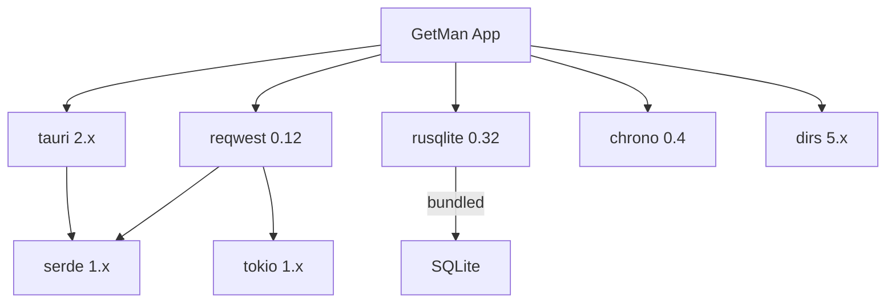

# GetMan - 依赖文档

## 后端依赖 (Rust)

| 依赖 | 版本 | 用途 |
|------|------|------|
| tauri | 2.x | 桌面应用框架，提供 IPC、窗口管理、打包 |
| tauri-plugin-opener | 2.x | 系统默认程序打开文件/URL |
| serde | 1.x | 序列化/反序列化框架 |
| serde_json | 1.x | JSON 序列化 |
| reqwest | 0.12 | HTTP 客户端，支持异步请求 |
| rusqlite | 0.32 (bundled) | SQLite 数据库，bundled 模式自带 SQLite |
| tokio | 1.x (full) | 异步运行时 |
| chrono | 0.4 | 日期时间处理 |
| dirs | 5.x | 获取系统目录路径（用户数据目录） |

### 依赖关系

## 前端依赖 (TypeScript)

### 运行时依赖

| 依赖 | 版本 | 用途 |
|------|------|------|
| react | 19.x | UI 框架 |
| react-dom | 19.x | React DOM 渲染 |
| zustand | 5.x | 轻量状态管理 |
| @tauri-apps/api | 2.x | Tauri 前端 API (invoke 等) |
| @tauri-apps/plugin-opener | 2.x | 打开外部链接 |

### 开发依赖

| 依赖 | 版本 | 用途 |
|------|------|------|
| typescript | 5.8.x | TypeScript 编译器 |
| vite | 7.x | 构建工具 |
| @vitejs/plugin-react | 4.x | Vite React 插件 |
| @tauri-apps/cli | 2.x | Tauri CLI 工具 |
| @types/react | 19.x | React 类型定义 |
| @types/react-dom | 19.x | React DOM 类型定义 |

## 特点

- **零第三方 UI 库** - 所有 UI 组件手写，无 Ant Design / MUI 等依赖
- **极简前端依赖** - 仅 React + Zustand + Tauri API
- **Rust 原生性能** - HTTP 请求和数据库操作在 Rust 端完成
- **SQLite bundled** - 无需系统安装 SQLite
