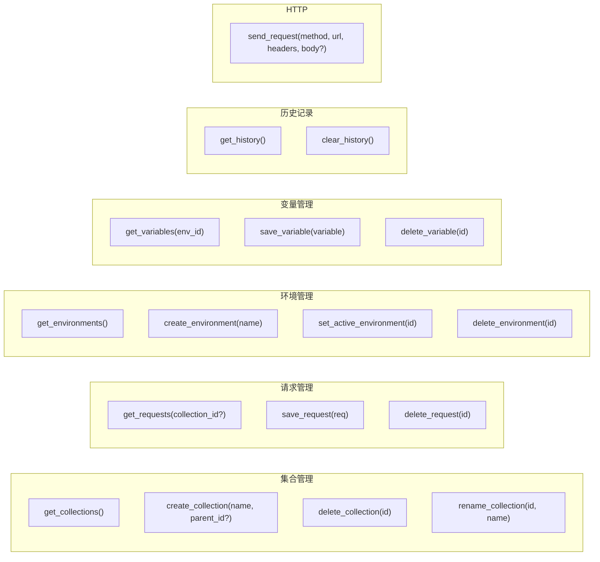

# GetMan - 接口文档

## Tauri Commands (IPC 接口)

前端通过 `@tauri-apps/api` 的 `invoke()` 调用后端 Rust 函数。所有 Commands 定义在 `src-tauri/src/lib.rs`。

## Command 详细接口

### 集合管理

| Command | 参数 | 返回值 |
|---------|------|--------|
| `get_collections` | 无 | `Vec<Collection>` |
| `create_collection` | `name: String, parent_id: Option<i64>` | `i64` (新 ID) |
| `delete_collection` | `id: i64` | `()` |
| `rename_collection` | `id: i64, name: String` | `()` |

### 请求管理

| Command | 参数 | 返回值 |
|---------|------|--------|
| `get_requests` | `collection_id: Option<i64>` | `Vec<Request>` |
| `save_request` | `req: Request` | `i64` (新/更新 ID) |
| `delete_request` | `id: i64` | `()` |

### 环境管理

| Command | 参数 | 返回值 |
|---------|------|--------|
| `get_environments` | 无 | `Vec<Environment>` |
| `create_environment` | `name: String` | `i64` |
| `set_active_environment` | `id: i64` | `()` |
| `delete_environment` | `id: i64` | `()` |

### 变量管理

| Command | 参数 | 返回值 |
|---------|------|--------|
| `get_variables` | `env_id: i64` | `Vec<Variable>` |
| `save_variable` | `variable: Variable` | `i64` |
| `delete_variable` | `id: i64` | `()` |

### 历史记录

| Command | 参数 | 返回值 |
|---------|------|--------|
| `get_history` | 无 | `Vec<HistoryItem>` |
| `clear_history` | 无 | `()` |

### HTTP 请求

| Command | 参数 | 返回值 |
|---------|------|--------|
| `send_request` | `method: String, url: String, headers: HashMap<String,String>, body: Option<String>` | `HttpResponse` |

`send_request` 会自动将请求保存到历史记录。

## 前端 Store 接口

### 主 Store (store.ts)

Zustand store，通过 `invoke()` 与后端通信。

**状态字段**:
- `collections`, `requests`, `environments`, `history`, `variables`
- `activeRequest`, `response`, `loading`, `activeEnvId`

**方法**: 与 Tauri Commands 一一对应，外加 `restoreFromHistory`、`setActiveRequest` 等纯前端方法。

### Settings Store (stores/settings.ts)

localStorage 持久化，管理 UI 偏好设置。

### Tabs Store (stores/tabs.ts)

localStorage 持久化，管理多标签页状态。
