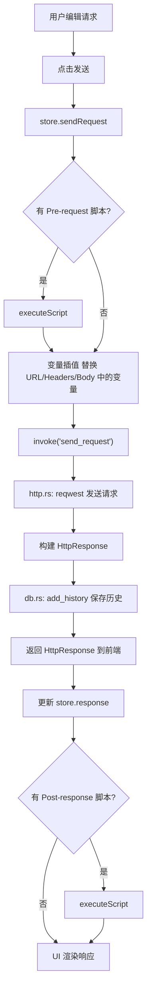
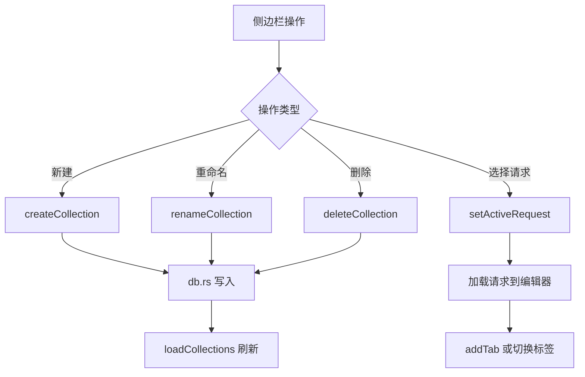
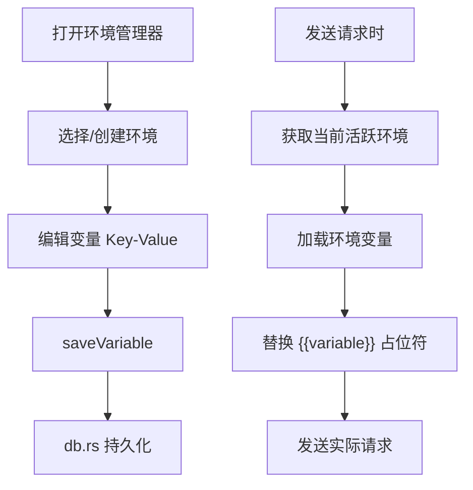
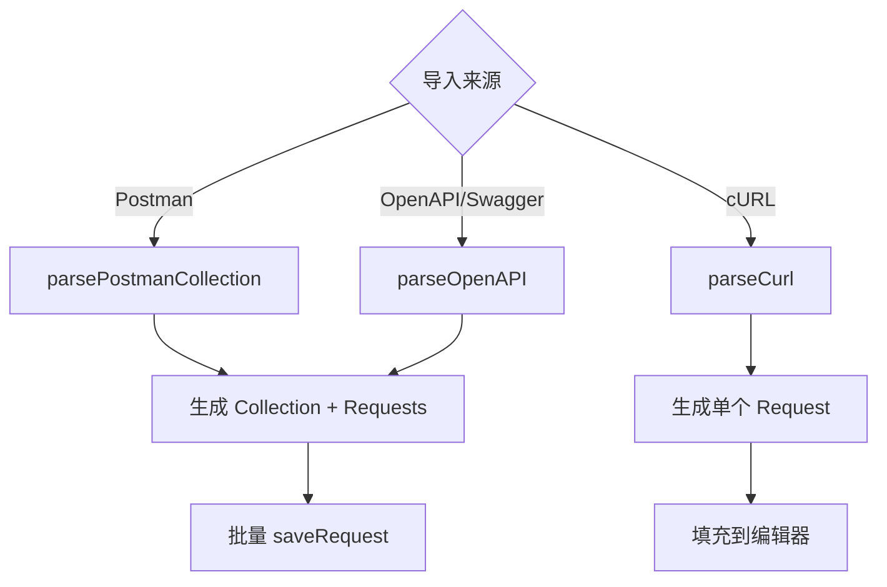
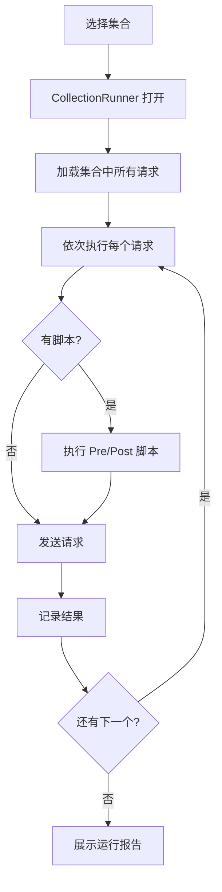

# GetMan - 工作流程

## 核心工作流

### 1. 发送 HTTP 请求

### 2. 集合管理

### 3. 环境变量工作流

### 4. 导入工作流

### 5. 集合批量运行

## 数据持久化策略

| 数据类型 | 存储位置 | 持久化方式 |
|---------|---------|-----------|
| 集合/请求/环境/变量/历史 | SQLite | Tauri Commands → db.rs |
| 设置偏好 | localStorage | Zustand persist |
| 标签页状态 | localStorage | Zustand persist |
| 响应数据 | 内存 | 不持久化 |
