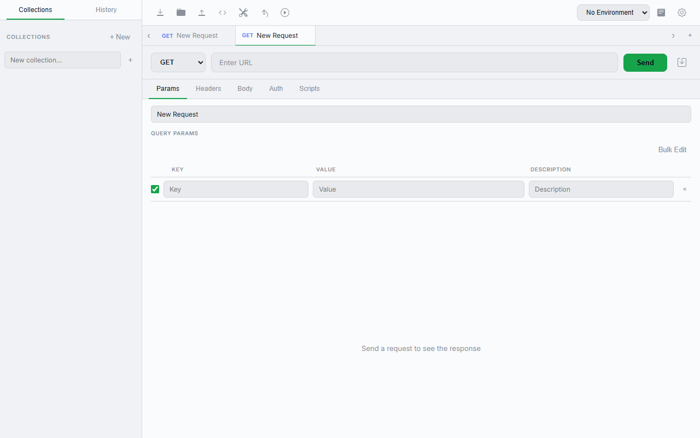
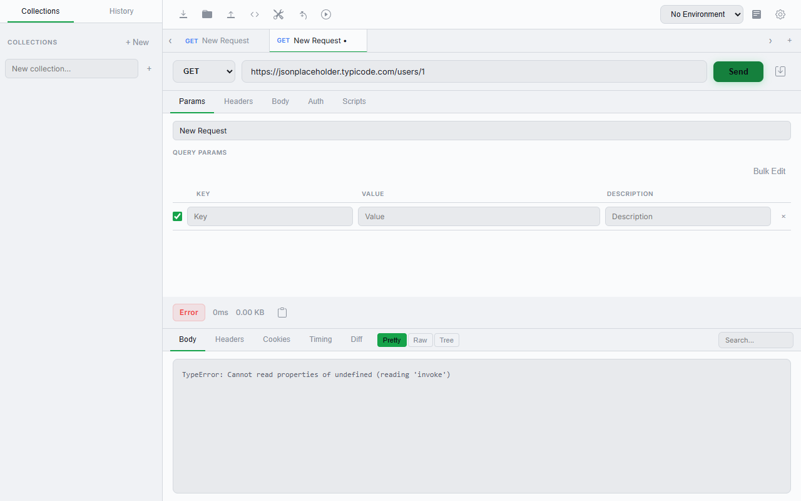

<p align="center">
  
</p>
<h1 align="center">GetMan</h1>
<p align="center">极简轻量的 API 测试工具</p>
<p align="center">
  <a href="#功能特性">功能</a> •
  <a href="#截图预览">截图</a> •
  <a href="#快速开始">快速开始</a> •
  <a href="#技术栈">技术栈</a> •
  <a href="#开发">开发</a>
</p>

---

## 为什么选择 GetMan？

Postman 越来越臃肿了。登录、云同步、团队协作……你只是想发个请求而已。

GetMan 回归本质：**快速、轻量、离线优先**。

| | GetMan | Postman |
|---|---|---|
| 安装包大小 | ~15 MB | ~200 MB |
| 启动时间 | < 1 秒 | 5-10 秒 |
| 内存占用 | < 100 MB | 300-500 MB |
| 需要登录 | ❌ | ✅ |
| 离线使用 | ✅ | 部分功能 |

## 截图预览

### 主界面



### 响应查看



## 功能特性

### 核心功能
- 🚀 **HTTP 请求** — GET / POST / PUT / PATCH / DELETE / HEAD / OPTIONS
- 📝 **请求体编辑** — JSON / Form Data / Raw / Binary
- 🎨 **响应美化** — JSON 格式化、语法高亮、树形展示
- 📁 **集合管理** — 树形结构、拖拽排序、文件夹组织
- 🔄 **环境变量** — 多环境切换、`{{variable}}` 插值
- 📜 **历史记录** — 自动保存、一键恢复

### 高级功能
- 🌐 **WebSocket** — 实时连接测试
- 📊 **请求时序** — 可视化响应时间分析
- 🔀 **响应对比** — Diff 查看器
- 📦 **批量运行** — 集合一键执行
- 💻 **代码生成** — 支持 10 种语言/格式
- 📥 **导入支持** — Postman 集合、OpenAPI、cURL
- ⚡ **Pre/Post 脚本** — 请求前后自动化
- 🛠️ **开发工具** — Base64、URL 编解码、UUID 生成等

## 快速开始

### 环境要求

- [Node.js](https://nodejs.org/) >= 18
- [Rust](https://www.rust-lang.org/tools/install) >= 1.70
- Windows 10/11（macOS 和 Linux 支持计划中）

### 安装与运行

```bash
# 克隆项目
git clone https://github.com/fortianwei/GetMan.git
cd GetMan

# 安装依赖
npm install

# 开发模式运行
node_modules/.bin/tauri dev
```

### 构建发布版

```bash
node_modules/.bin/tauri build
```

构建产物在 `src-tauri/target/release/bundle/` 目录下。

## 技术栈

| 层级 | 技术 |
|------|------|
| 桌面框架 | [Tauri 2.0](https://tauri.app/) (Rust) |
| 前端 | [React 19](https://react.dev/) + TypeScript |
| 构建工具 | [Vite 7](https://vite.dev/) |
| 状态管理 | [Zustand](https://zustand.docs.pmnd.rs/) |
| 数据库 | SQLite (rusqlite) |
| HTTP 客户端 | reqwest (Rust) |

## 项目结构

```
src/                        # React 前端
├── App.tsx                 # 主应用组件
├── store.ts                # Zustand 状态管理
├── components/             # 15 个 UI 组件
├── utils/                  # 工具函数
└── styles/                 # 样式文件

src-tauri/src/              # Rust 后端
├── lib.rs                  # Tauri Commands
├── db.rs                   # SQLite 数据库操作
└── http.rs                 # HTTP 请求处理
```

## 开发

```bash
# 仅前端开发（热更新，端口 1420）
npm run dev

# 完整开发模式（含 Tauri 窗口）
node_modules/.bin/tauri dev

# 构建
node_modules/.bin/tauri build
```

## 路线图

- [x] 基础 HTTP 请求
- [x] 集合管理
- [x] 环境变量
- [x] 历史记录
- [x] WebSocket 支持
- [x] 代码生成
- [x] 导入 Postman/OpenAPI/cURL
- [ ] macOS / Linux 支持
- [ ] 插件系统
- [ ] 国际化 (i18n)

## 许可证

[MIT](LICENSE)

---

<p align="center">
  用 ❤️ 和 Rust 构建
</p>
